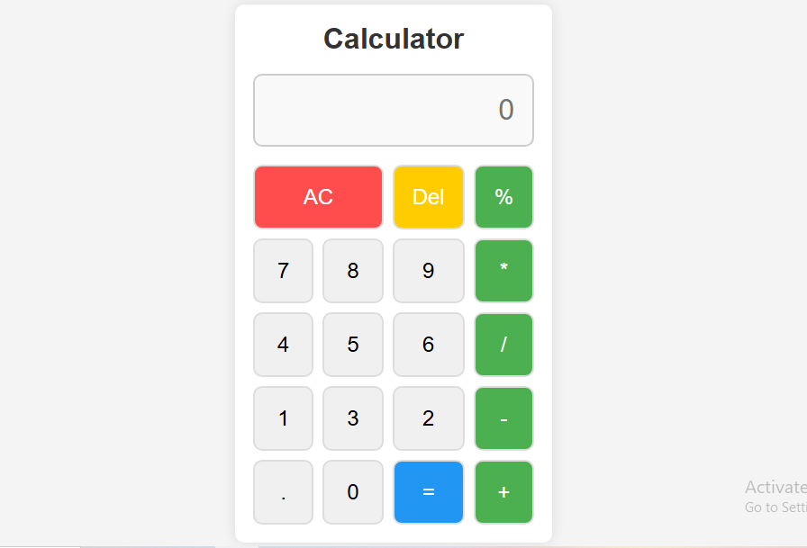

## 🧮 JavaScript Calculator

A simple and responsive Calculator Web App built using HTML, CSS, and JavaScript.
This calculator performs basic arithmetic operations with a clean and user-friendly interface.

## 🚀 Features

➕ Addition

➖ Subtraction

✖️ Multiplication

➗ Division

🔄 Clear / Reset functionality

⌨️ Button-based input

📱 Responsive design

## 🛠️ Technologies Used

HTML5 – Structure

CSS3 – Styling & layout

JavaScript (ES6) – Calculator logic

📂 Project Structure
<pre>  
js-calculator/
│
├── index.html
├── style.css
├── script.js
└── README.md
</pre>

## ⚙️ How It Works

User inputs numbers using calculator buttons

JavaScript handles input, operations, and result display

eval() / custom logic is used to calculate expressions

Clear button resets the calculator display

## ▶️ How to Run the Project

Clone the repository:

git clone https://github.com/usama247550/calculator-js.git

Open the project folder

Open index.html in your browser

✅ No installation or setup required

## 📸 Screenshots
<table>
  <tr>
    <td>
      
    </td>
  </tr>
</table>

## 🎯 Use Case

Beginner-friendly JavaScript project

Practice DOM manipulation

Understanding event handling and basic logic

## 📌 Future Improvements

⌨️ Keyboard support

🧮 Scientific calculator functions

🌙 Dark mode

❌ Better error handling

## 👨‍💻 Author

Usama MERN Stack Developer

GitHub: https://github.com/usama247550

LinkedIn: https://www.linkedin.com/in/usama-javed-112186320

## ⭐ Show Your Support

If you like this project, give it a ⭐ on GitHub!

